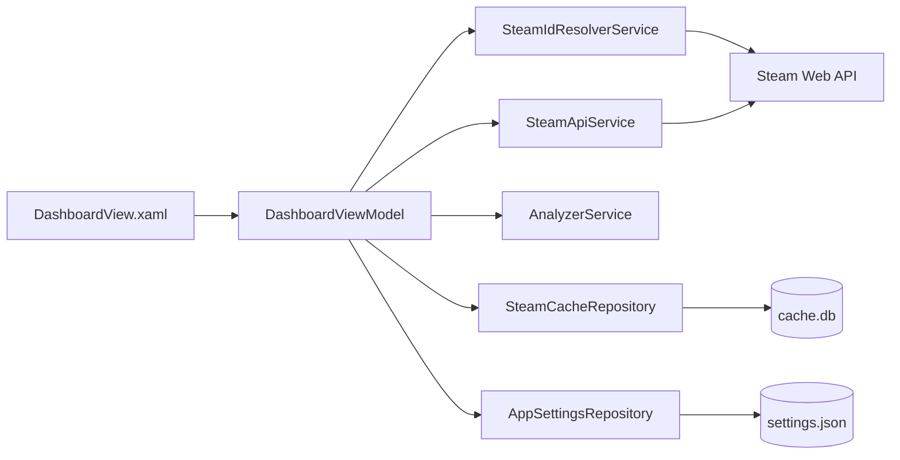

# OpenSteamAnalyzer


OpenSteamAnalyzer 是一个基于 **WPF + .NET 8** 的 Steam 账号数据分析工具，用于读取公开可访问的 Steam 个人资料和游戏库数据，并以仪表盘的形式展示游戏数量、总游玩时长、平均游玩时长、未玩游戏数量、近两周游玩时长、Top 游戏排行和游玩时长分布。

项目定位是一个轻量级的桌面端 Steam 游戏库分析器，适合用于学习 WPF、Prism、MVVM、Steam Web API、SQLite 本地缓存和数据可视化。

---

## 功能特性

- 支持输入 SteamID64
- 支持输入 Steam 个人主页链接
  - `https://steamcommunity.com/profiles/{SteamID64}`
  - `https://steamcommunity.com/id/{自定义ID}`
- 支持 Steam 自定义主页链接解析
- 支持读取 Steam 用户基础资料
  - 昵称
  - 头像
  - 在线状态
  - Steam 等级
  - 个人主页链接
  - 国家/地区代码
- 支持读取 Steam 游戏库
  - 游戏名称
  - AppId
  - 总游玩时长
  - 近两周游玩时长
  - 最后游玩时间
  - 游戏图标
- 支持数据统计
  - 游戏总数
  - 总游玩时长
  - 平均游玩时长
  - 未玩游戏数量
  - 近两周游玩时长
  - Top 10 游戏排行
  - 游玩时长区间分布
- 支持图表展示
  - Top 游戏柱状图
  - 游玩时长分布饼图
- 支持游戏列表搜索
- 支持游戏筛选
  - 全部游戏
  - 已玩
  - 未玩
- 支持游戏排序
  - 游玩时长
  - 名称
  - 最近游玩
- 支持 Steam API Key 本地保存
- 支持环境变量读取 Steam API Key
- 支持本地 SQLite 缓存
- 支持缓存自动复用
- 支持强制刷新数据
- 支持头像框、动态头像、个人资料背景等 Steam 装饰资源展示
- 使用 Soft UI 风格界面

---

## 项目截图

当前仓库暂未提供截图。建议后续将截图放到 `docs/images/` 目录，例如：

```md

```

---

## 技术栈

| 技术 | 用途 |
|---|---|
| C# | 主开发语言 |
| .NET 8 | 应用运行框架 |
| WPF | Windows 桌面 UI |
| Prism.Wpf | MVVM 与应用框架 |
| Prism.DryIoc | 依赖注入容器 |
| LiveChartsCore.SkiaSharpView.WPF | 图表展示 |
| Microsoft.Data.Sqlite | 本地缓存数据库 |
| Microsoft.Web.WebView2 | 动态头像和头像框展示 |
| System.Security.Cryptography.ProtectedData | Steam API Key 本地加密保存 |
| Steam Web API | Steam 用户与游戏库数据来源 |

---

## 系统要求

- Windows 10 / Windows 11
- .NET 8 SDK
- 支持 WPF 开发的 IDE，例如：
  - Visual Studio
  - JetBrains Rider
  - VS Code + .NET SDK
- Microsoft Edge WebView2 Runtime

如果动态头像、头像框或 WebView2 相关内容无法显示，请先确认系统是否安装了 WebView2 Runtime。

---

## 快速开始

### 1. 克隆项目

```bash
git clone https://github.com/Maplelanyan/OpenSteamAnalyzer.git
cd OpenSteamAnalyzer
```

### 2. 还原依赖

```bash
dotnet restore .\OpenSteamAnalyzer\OpenSteamAnalyzer.csproj
```

### 3. 运行项目

```bash
dotnet run --project .\OpenSteamAnalyzer\OpenSteamAnalyzer.csproj
```

也可以直接用 Visual Studio 打开：

```text
OpenSteamAnalyzer.slnx
```

然后选择 `OpenSteamAnalyzer` 项目运行。

---

## Steam API Key 配置

OpenSteamAnalyzer 需要 Steam Web API Key 才能访问 Steam Web API。

Steam Web API Key 获取页面：

```text
https://steamcommunity.com/dev/apikey
```

### 方式一：在应用内保存

启动应用后，在界面中的 `Steam API Key` 输入框填入 Key，然后点击：

```text
保存 Key
```

应用会将 Key 保存到本地配置中，并使用 Windows 当前用户的 DPAPI 进行加密保护。

### 方式二：使用环境变量

也可以通过环境变量配置：

```powershell
[Environment]::SetEnvironmentVariable("STEAM_API_KEY", "你的 Steam API Key", "User")
```

设置后重新启动应用。

如果同时存在环境变量和本地保存的 Key，应用会优先使用环境变量 `STEAM_API_KEY`。

---

## 使用方法

1. 启动 OpenSteamAnalyzer。
2. 输入 SteamID64 或 Steam 主页链接。
3. 输入并保存 Steam API Key。
4. 点击 `分析`。
5. 等待数据加载完成。
6. 查看账号信息、统计卡片、图表和游戏列表。
7. 如需绕过缓存重新请求 Steam API，点击 `强制刷新`。

支持的输入示例：

```text
7656119xxxxxxxxxx
https://steamcommunity.com/profiles/7656119xxxxxxxxxx
https://steamcommunity.com/id/example
```

---

## 数据说明

### 统计指标

| 指标 | 说明 |
|---|---|
| 游戏总数 | Steam 游戏库中返回的游戏数量 |
| 总游玩时长 | 所有游戏 `playtime_forever` 累加后换算为小时 |
| 平均时长 | 总游玩时长 / 游戏总数 |
| 未玩游戏 | 总游玩时间为 0 的游戏数量 |
| 近两周 | Steam API 返回的近两周游玩时间 |
| Top 游戏 | 按总游玩时长排序的前 10 个游戏 |
| 游玩分布 | 按游玩时长区间统计游戏数量 |

### 游玩时长分布区间

```text
未玩
0-2h
2-10h
10-50h
50h+
```

---

## 本地缓存

项目会在本地保存设置和 Steam 数据缓存。

默认目录：

```text
%LOCALAPPDATA%\OpenSteamAnalyzer
```

可能包含：

```text
settings.json
cache.db
media-cache/
```

说明：

| 文件/目录 | 用途 |
|---|---|
| `settings.json` | 保存 Steam 输入记录和加密后的 API Key |
| `cache.db` | SQLite 数据缓存 |
| `media-cache/` | Steam 动态背景等媒体缓存 |

默认缓存有效期为：

```text
6 小时
```

在缓存有效期内点击 `分析` 会优先使用本地缓存。点击 `强制刷新` 会重新请求 Steam API。

---

## 项目结构

```text
OpenSteamAnalyzer
├─ OpenSteamAnalyzer.slnx
├─ README.md
├─ OpenSteamAnalyzer
│  ├─ App.xaml
│  ├─ App.xaml.cs
│  ├─ MainWindow.xaml
│  ├─ MainWindow.xaml.cs
│  ├─ OpenSteamAnalyzer.csproj
│  ├─ Models
│  │  ├─ AppSettings.cs
│  │  ├─ CachedSteamLibrary.cs
│  │  ├─ GameTimeBucket.cs
│  │  ├─ LibraryAnalysis.cs
│  │  ├─ SteamGame.cs
│  │  └─ SteamProfile.cs
│  ├─ Repositories
│  │  ├─ AppSettingsRepository.cs
│  │  ├─ IAppSettingsRepository.cs
│  │  ├─ ISteamCacheRepository.cs
│  │  └─ SteamCacheRepository.cs
│  ├─ Services
│  │  ├─ AnalyzerService.cs
│  │  ├─ IAnalyzerService.cs
│  │  ├─ ISteamApiService.cs
│  │  ├─ ISteamIdResolverService.cs
│  │  ├─ SteamApiException.cs
│  │  ├─ SteamApiOptions.cs
│  │  ├─ SteamApiService.cs
│  │  └─ SteamIdResolverService.cs
│  ├─ ViewModels
│  │  ├─ AsyncDelegateCommand.cs
│  │  └─ DashboardViewModel.cs
│  ├─ Views
│  │  ├─ DashboardView.xaml
│  │  └─ DashboardView.xaml.cs
│  └─ Resources
│     ├─ AppIcon.ico
│     └─ SoftUi.xaml
```

---

## 架构说明

项目整体采用 WPF + MVVM 分层结构。



### View

负责界面展示和少量 UI 交互逻辑。

主要文件：

```text
Views/DashboardView.xaml
Views/DashboardView.xaml.cs
MainWindow.xaml
```

### ViewModel

负责页面状态、命令、数据绑定、搜索筛选排序和业务流程调度。

主要文件：

```text
ViewModels/DashboardViewModel.cs
ViewModels/AsyncDelegateCommand.cs
```

### Services

负责 Steam API 请求、SteamID 解析和游戏库统计分析。

主要文件：

```text
Services/SteamApiService.cs
Services/SteamIdResolverService.cs
Services/AnalyzerService.cs
```

### Repositories

负责本地配置和本地缓存。

主要文件：

```text
Repositories/AppSettingsRepository.cs
Repositories/SteamCacheRepository.cs
```

### Models

负责数据结构定义。

主要文件：

```text
Models/SteamProfile.cs
Models/SteamGame.cs
Models/LibraryAnalysis.cs
Models/CachedSteamLibrary.cs
```

---

## Steam Web API 使用情况

项目当前使用了以下 Steam Web API 能力：

| API | 用途 |
|---|---|
| `ISteamUser/ResolveVanityURL` | 解析自定义主页 ID |
| `ISteamUser/GetPlayerSummaries` | 获取用户基础信息 |
| `IPlayerService/GetOwnedGames` | 获取游戏库 |
| `IPlayerService/GetRecentlyPlayedGames` | 获取近两周游玩 |
| `IPlayerService/GetSteamLevel` | 获取 Steam 等级 |
| `IPlayerService/GetProfileItemsEquipped` | 获取装备中的个人资料装饰 |
| `IPlayerService/GetAvatarFrame` | 获取头像框 |
| `IPlayerService/GetAnimatedAvatar` | 获取动态头像 |

---

## 隐私与安全

OpenSteamAnalyzer 会读取并缓存 Steam Web API 返回的数据。

请注意：

- 不要将 Steam API Key 提交到 GitHub。
- 不要把 Steam API Key 写死在源码里。
- 推荐使用环境变量 `STEAM_API_KEY`。
- 本地保存的 API Key 会使用 Windows 当前用户的 DPAPI 加密。
- 如果 API Key 泄露，请立即到 Steam API Key 页面撤销并重新生成。
- 只能读取 Steam API 允许访问的数据。
- 如果目标账号游戏库不是公开可访问，游戏库数据可能无法读取。

---

## 常见问题

### 1. 提示未配置 Steam API Key

请先配置环境变量：

```powershell
[Environment]::SetEnvironmentVariable("STEAM_API_KEY", "你的 Steam API Key", "User")
```

或者在应用界面输入 Key 后点击 `保存 Key`。

### 2. 输入自定义主页链接无法解析

请确认链接格式是否正确：

```text
https://steamcommunity.com/id/example
```

同时确认 Steam API Key 可用。

### 3. 游戏库为空或无法读取

可能原因：

- 目标账号游戏库不是公开状态
- Steam API Key 无效
- Steam API 请求被限制
- Steam 服务暂时不可用
- 网络请求失败

### 4. 动态头像或头像框不显示

可能原因：

- WebView2 Runtime 未安装
- Steam 未返回动态装饰资源
- 网络加载失败
- 资源 URL 不可访问

### 5. 数据没有刷新

默认会优先使用 6 小时内的缓存。

如需重新请求 Steam API，请点击：

```text
强制刷新
```

---

## 开发说明

### 推荐开发环境

- Windows 10 / Windows 11
- .NET 8 SDK
- Visual Studio
- JetBrains Rider
- Git

### 编译 Debug

```bash
dotnet build .\OpenSteamAnalyzer\OpenSteamAnalyzer.csproj -c Debug
```

### 编译 Release

```bash
dotnet build .\OpenSteamAnalyzer\OpenSteamAnalyzer.csproj -c Release
```

### 发布框架依赖版本

```bash
dotnet publish .\OpenSteamAnalyzer\OpenSteamAnalyzer.csproj -c Release -r win-x64 --self-contained false -o .\publish
```

### 发布独立版本

```bash
dotnet publish .\OpenSteamAnalyzer\OpenSteamAnalyzer.csproj -c Release -r win-x64 --self-contained true -p:PublishSingleFile=true -p:IncludeNativeLibrariesForSelfExtract=true -o .\publish
```

---

## 代码风格建议

本项目建议保持以下风格：

- 使用 MVVM 分层
- View 只负责 UI 和少量无法避免的控件逻辑
- ViewModel 负责状态和命令
- Service 负责业务逻辑
- Repository 负责持久化
- Steam API 异常统一转换为用户可读错误
- 不在 UI 线程中执行耗时请求
- 不在仓库中提交任何真实 Steam API Key

---

## 后续计划

可以考虑继续完善以下功能：

- 添加项目截图
- 添加 Release 自动构建
- 添加 GitHub Actions
- 添加单元测试项目
- 添加更多图表
- 添加成就统计
- 添加游戏类型/标签分析
- 添加游玩趋势分析
- 添加多账号对比
- 添加导出 CSV / JSON
- 添加主题切换
- 添加更多语言支持
- 添加缓存清理入口
- 添加错误日志文件
- 添加应用内版本信息
- 添加设置页

---

## 贡献

欢迎提交 Issue 或 Pull Request。

建议贡献流程：

1. Fork 本仓库
2. 创建功能分支

```bash
git checkout -b feature/your-feature
```

3. 提交修改

```bash
git commit -m "feat: add your feature"
```

4. 推送分支

```bash
git push origin feature/your-feature
```

5. 创建 Pull Request

---

## License

当前仓库暂未包含明确的 License 文件。

如果你希望该项目作为开源项目长期维护，建议补充一个 License，例如：

- MIT License
- Apache License 2.0
- GPL-3.0 License

---

## 免责声明

OpenSteamAnalyzer 不是 Steam 或 Valve 官方项目。

本项目仅用于学习、研究和个人数据分析。Steam、Steam 图标、Steam Web API 以及相关资源归 Valve Corporation 所有。

使用本项目时，请遵守 Steam Web API 的相关条款与限制。
