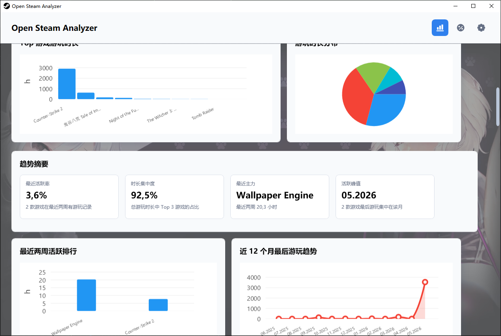
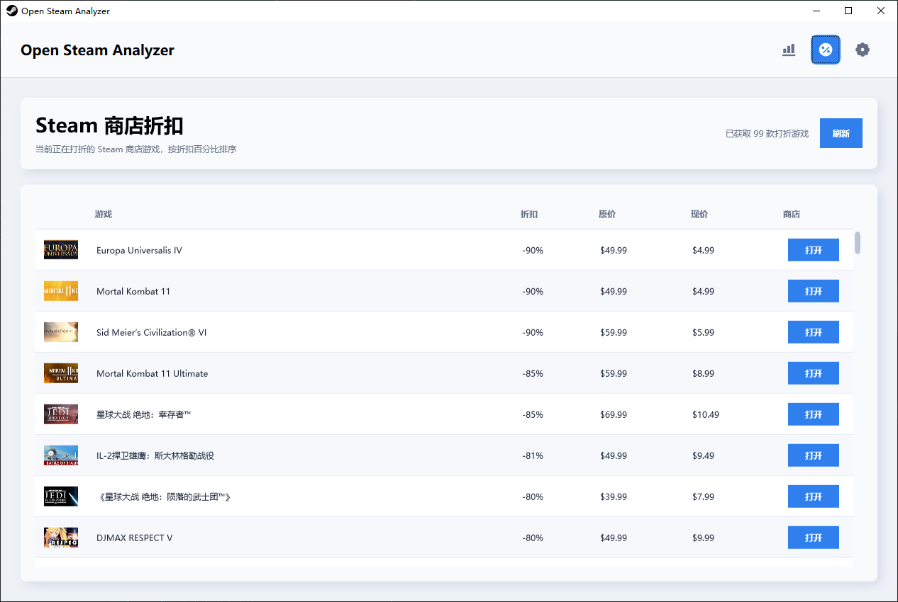
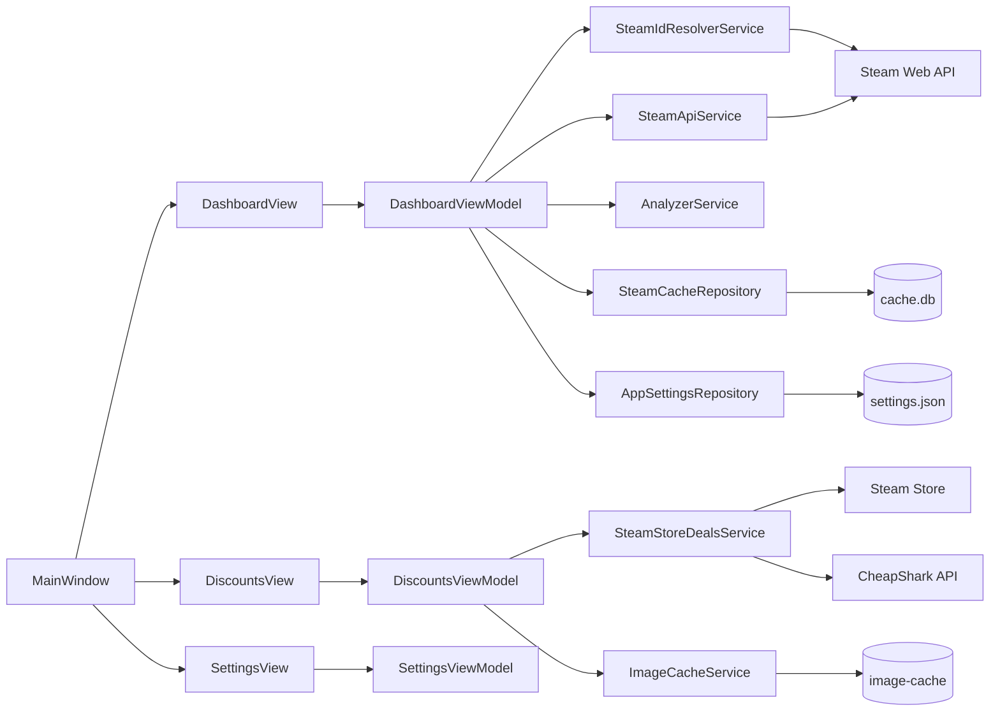

# OpenSteamAnalyzer


OpenSteamAnalyzer 是一个基于 **WPF + .NET 8** 的 Steam 账号与游戏库分析工具。它通过 Steam Web API 读取公开账号资料、游戏库、好友列表、个人资料装饰资源，并在本地桌面应用中展示账号概览、游玩统计、趋势图表、好友等级排行和 Steam 商店折扣信息。

项目定位是一个轻量但信息密度高的 Windows 桌面仪表盘：使用 Prism 组织 MVVM 结构，使用 SQLite 做本地缓存，使用 LiveChartsCore 展示图表，并支持 Steam 动态头像、头像框、个人资料背景和迷你个人资料动态背景的展示。

## 功能

- 支持输入 SteamID64、`https://steamcommunity.com/profiles/{steamid}`、`https://steamcommunity.com/id/{vanity}` 或裸 vanity ID。
- 自动解析 Steam 自定义主页 ID。
- 支持历史账号下拉选择，显示时会省略 `https://steamcommunity.com/id/` 等固定前缀。
- 读取 Steam 用户资料：昵称、头像、在线状态、Steam 等级、主页链接、个人资料装饰资源。
- 读取游戏库：游戏名称、AppId、总游玩时长、近两周游玩时长、最后游玩时间、游戏图标。
- 展示统计卡片：游戏总数、总时长、平均时长、未玩游戏数、近两周时长。
- 展示图表和趋势分析：Top 游戏、游玩时长分布、近两周活跃排行、近 12 个月趋势、累计游玩时长占比、趋势摘要。
- 支持游戏列表搜索、筛选和排序。
- 支持好友列表，按 Steam 等级从高到低排序。
- 好友列表展示头像、昵称、状态、等级和成为好友时间。
- 可从好友列表直接点击分析指定好友的 Steam 信息。
- 支持独立设置页，用于保存默认 Steam 输入和 Steam API Key。
- 支持 Steam API Key 本地加密保存，使用 Windows 当前用户 DPAPI。
- 支持 `STEAM_API_KEY` 环境变量，优先级高于本地保存的 Key。
- 支持独立 Steam 商店折扣页，展示正在打折的游戏、折扣百分比、原价、现价和封面图。
- 折扣页图片会缓存到本地，滚动列表时不会反复重新下载。
- 折扣页“打开”按钮优先通过 `steam://store/{appid}` 打开 Steam 客户端商店页，失败时回退到网页。
- 使用 SQLite 缓存账号资料和游戏库，默认缓存有效期为 6 小时。
- 支持强制刷新，绕过本地缓存重新请求 Steam API。
- 支持静态/动态头像、头像框、个人资料背景、迷你个人资料动态背景展示。
- 动态媒体资源会下载到本地媒体缓存后播放，减少重复加载。

## 截图





## 技术栈

| 技术 | 用途 |
|---|---|
| C# / .NET 8 | 应用主体和运行时 |
| WPF | Windows 桌面 UI |
| Prism.Wpf / Prism.DryIoc | MVVM、依赖注入和应用启动 |
| LiveChartsCore.SkiaSharpView.WPF | 图表展示 |
| Microsoft.Data.Sqlite | 本地缓存数据库 |
| Microsoft.Web.WebView2 | 动态头像和头像框渲染 |
| System.Security.Cryptography.ProtectedData | 本地 API Key 加密 |
| Steam Web API | Steam 账号、游戏库、好友和资料装饰数据 |
| Steam Store / CheapShark API | 商店折扣数据来源和备用来源 |

## 系统要求

- Windows 10 / Windows 11
- .NET 8 SDK
- Microsoft Edge WebView2 Runtime
- 可访问 Steam Web API、Steam 商店和 Steam 静态资源域名的网络环境
- 如需从折扣页直接打开客户端商店页，需要本机安装 Steam 并正确关联 `steam://` 协议

开发推荐使用 Visual Studio、JetBrains Rider 或 VS Code + .NET SDK。

## 快速开始

```powershell
git clone https://github.com/Maplelanyan/OpenSteamAnalyzer.git
cd OpenSteamAnalyzer
dotnet restore .\OpenSteamAnalyzer\OpenSteamAnalyzer.csproj
dotnet run --project .\OpenSteamAnalyzer\OpenSteamAnalyzer.csproj
```

也可以直接用 Visual Studio 打开 `OpenSteamAnalyzer.slnx` 后运行 `OpenSteamAnalyzer` 项目。

## Steam API Key

应用需要 Steam Web API Key 才能读取账号、游戏库、好友和资料装饰数据。Key 获取地址：

```text
https://steamcommunity.com/dev/apikey
```

配置方式一：在应用内进入“设置”页，填写 `Steam API Key` 并保存。Key 会写入本地 `settings.json`，并使用 Windows 当前用户 DPAPI 加密。

配置方式二：使用环境变量：

```powershell
[Environment]::SetEnvironmentVariable("STEAM_API_KEY", "你的 Steam API Key", "User")
```

设置后重新启动应用。如果环境变量和本地保存的 Key 同时存在，应用会优先使用 `STEAM_API_KEY`。

## 使用方式

1. 启动应用。
2. 打开“设置”页，保存 Steam API Key。
3. 回到“分析”页，输入 SteamID64、Steam 主页链接或自定义 ID。
4. 点击“分析”。
5. 查看账号资料、等级、好友列表、统计卡片、图表趋势和游戏列表。
6. 需要获取最新数据时点击“强制刷新”。
7. 打开“商店折扣”页可查看当前正在打折的 Steam 游戏。

支持的输入示例：

```text
7656119xxxxxxxxxx
https://steamcommunity.com/profiles/7656119xxxxxxxxxx
https://steamcommunity.com/id/example
example
```

## 本地数据

应用数据默认保存到：

```text
%LOCALAPPDATA%\OpenSteamAnalyzer
```

常见文件和目录：

| 路径 | 说明 |
|---|---|
| `settings.json` | 保存默认 Steam 输入、历史账号和加密后的 API Key |
| `cache.db` | SQLite 缓存，保存账号资料和游戏库 |
| `image-cache/` | Steam 商店折扣封面等图片缓存 |
| `media-cache/` | 动态资料背景等视频媒体缓存 |

“分析”会优先使用 6 小时内的缓存；“强制刷新”会重新请求 Steam API 并更新缓存。

## 项目结构

```text
OpenSteamAnalyzer/
|-- OpenSteamAnalyzer.slnx
|-- README.md
|-- docs/
|   `-- images/
`-- OpenSteamAnalyzer/
    |-- App.xaml
    |-- MainWindow.xaml
    |-- OpenSteamAnalyzer.csproj
    |-- Models/
    |-- Repositories/
    |-- Resources/
    |-- Services/
    |-- ViewModels/
    `-- Views/
```

主要职责：

| 目录 | 职责 |
|---|---|
| `Models` | Steam 资料、游戏、好友、折扣游戏、分析结果和缓存对象 |
| `Services` | Steam API 请求、SteamID 解析、游戏库分析、商店折扣、图片/媒体缓存 |
| `Repositories` | 本地设置和 SQLite 缓存 |
| `ViewModels` | 页面状态、命令、列表筛选排序、图表数据 |
| `Views` | WPF 页面和必要的控件级交互 |
| `Resources` | 全局样式和应用资源 |

## 架构



## 使用的 Steam Web API

| API | 用途 |
|---|---|
| `ISteamUser/ResolveVanityURL` | 解析自定义主页 ID |
| `ISteamUser/GetPlayerSummaries` | 获取用户基础资料 |
| `ISteamUser/GetFriendList` | 获取好友 SteamID 列表 |
| `IPlayerService/GetOwnedGames` | 获取游戏库 |
| `IPlayerService/GetRecentlyPlayedGames` | 获取近两周游玩 |
| `IPlayerService/GetSteamLevel` | 获取账号等级和好友等级 |
| `IPlayerService/GetProfileItemsEquipped` | 获取装备中的个人资料装饰 |
| `IPlayerService/GetAvatarFrame` | 获取头像框 fallback 数据 |
| `IPlayerService/GetAnimatedAvatar` | 获取动态头像 fallback 数据 |

商店折扣页优先读取 Steam 商店折扣搜索结果；如果 Steam 商店请求失败，会使用 CheapShark 的 Steam 折扣数据作为备用来源。

## 常见问题

### 提示未配置 Steam API Key

在应用“设置”页保存 Key，或设置 `STEAM_API_KEY` 环境变量后重启应用。

### 游戏库为空或读取失败

常见原因包括目标账号游戏库未公开、API Key 无效、Steam API 限流、网络请求失败或 Steam 服务暂时不可用。

### 好友列表为空或无法读取好友等级

目标账号好友列表可能未公开，或者 Steam API 对好友/等级接口返回受限。好友等级会并发读取，但未知等级会排在列表最后。

### 动态头像或头像框不显示

先确认系统安装了 WebView2 Runtime。也可能是 Steam 未返回对应装饰资源，或资源 URL 当前不可访问。

### 动态背景不显示或不动

动态背景会先下载到 `%LOCALAPPDATA%\OpenSteamAnalyzer\media-cache`，再用 WPF 媒体组件播放。若某些视频编码在当前系统上不可播放，会回退到静态背景。

### 商店折扣页提示 SSL 连接失败

应用会尝试回退到 CheapShark 数据源。若两个数据源都失败，需要检查系统时间、证书、代理或网络环境。

### 折扣页点击“打开”没有进入 Steam 客户端

确认本机已安装 Steam，并且 Windows 已正确关联 `steam://` 协议。协议启动失败时应用会回退打开网页。

### 数据没有更新

“分析”默认复用 6 小时内缓存。需要立即请求最新数据时使用“强制刷新”。

## 开发命令

```powershell
dotnet build .\OpenSteamAnalyzer\OpenSteamAnalyzer.csproj -c Debug
dotnet build .\OpenSteamAnalyzer\OpenSteamAnalyzer.csproj -c Release
dotnet publish .\OpenSteamAnalyzer\OpenSteamAnalyzer.csproj -c Release -r win-x64 --self-contained false -o .\publish
```

独立发布：

```powershell
dotnet publish .\OpenSteamAnalyzer\OpenSteamAnalyzer.csproj -c Release -r win-x64 --self-contained true -p:PublishSingleFile=true -p:IncludeNativeLibrariesForSelfExtract=true -o .\publish
```

## 维护说明

- View 只保留必要的控件级逻辑，例如密码框、滚轮转发、媒体播放和 Steam 协议打开。
- ViewModel 负责状态、命令、数据加载流程、列表筛选排序和图表数据。
- Service 负责 Steam API、SteamID 解析、商店折扣、缓存和统计分析。
- Repository 负责本地持久化。
- 不要提交真实 Steam API Key。
- 不要把临时媒体缓存、图片缓存或本地数据库提交到仓库。

## 后续可改进方向

- 增加单元测试项目。
- 增加缓存清理入口。
- 增加 CSV / JSON 导出。
- 增加多账号对比。
- 增加更多商店筛选项，例如价格区间、折扣区间、标签或类型。
- 增加 CI 和 Release 自动构建。

## License

本项目基于 MIT License 开源，详见 [LICENSE](LICENSE)。

## 免责声明

OpenSteamAnalyzer 不是 Steam 或 Valve 官方项目。本项目仅用于学习、研究和个人数据分析。Steam、Steam Web API 以及相关资源归 Valve Corporation 所有。使用本项目时请遵守 Steam Web API 的相关条款和限制。
